# Architecture locale hybride Docling + PaddleOCR + Qwen2.5

Cette partie de l'application ajoute un moteur local pour extraire les informations metier depuis des documents heterogenes.

## Idee principale

Le modele Qwen2.5 n'est pas entraine dans ce projet. Il est utilise localement avec Ollama comme moteur de comprehension. Le backend lui donne:

- le contenu du document transforme en texte structure,
- le type de document cible,
- le schema JSON attendu,
- des consignes pour ne pas inventer de valeurs.

Qwen2.5 retourne ensuite un JSON, puis le backend applique des regles de validation.

## Flux de traitement

```mermaid
flowchart LR
    A["PDF ou image"] --> B["Backend FastAPI"]
    B --> C["Pretraitement"]
    C --> D["Docling"]
    D --> E["Markdown structure"]
    E --> F["Controle qualite"]
    F -->|Markdown exploitable| G["Qwen2.5 local via Ollama"]
    F -->|Markdown faible| H["PaddleOCR fallback"]
    H --> I["Texte brut OCR"]
    I --> G
    G --> J["JSON metier"]
    J --> K["Validation metier"]
    K --> L["SQLite, interface, exports"]
```



## Role des composants

| Composant | Role |
| --- | --- |
| FastAPI | Orchestre tout le pipeline apres l'upload. |
| Pretraitement | Verifie format, taille et validite, corrige l'orientation image, redimensionne, ameliore contraste/nettete et prepare les PDF. |
| Docling | Convertit PDF/image en Markdown en conservant texte, blocs, tableaux et ordre de lecture autant que possible. |
| Controle qualite | Verifie si le Markdown est assez long, lisible, avec chiffres et structure. |
| PaddleOCR | Recupere du texte brut si Docling produit un contenu pauvre ou inutilisable. |
| Ollama | Execute le modele Qwen2.5 en local. |
| Qwen2.5 | Lit le Markdown ou le texte OCR et extrait les champs dans le schema JSON demande. |
| Validation metier | Controle champs obligatoires, listes vides, montants et coherence minimale. |

## Schemas geres

Le backend selectionne le schema selon le choix utilisateur ou la detection automatique:

- `medical_lab_report`: patient, laboratoire, dossier, dates, analyses.
- `steg_invoice`: reference, montant a payer, periode, dates.
- `supplier_invoice`: fournisseur, client, lignes, totaux.
- `receipt`: magasin, date, articles, total, paiement.
- `unknown`: fallback si le type reste incertain.

## Trace technique dans les resultats

Chaque extraction locale ajoute un champ `local_pipeline` dans le JSON sauvegarde. Il indique:

- les operations de pretraitement appliquees,
- la source utilisee: `docling_markdown`, `paddleocr_text` ou `docling_markdown_low_quality`,
- le score qualite du Markdown Docling,
- si PaddleOCR a ete utilise,
- le modele Ollama/Qwen utilise,
- les erreurs et warnings de validation.

Cela permet d'expliquer pourquoi un document a bien marche ou pourquoi certains champs restent non detectes.

## Commandes utiles

Installer les dependances Python:

```powershell
python -m pip install -r requirements.txt
```

Installer le modele Qwen dans Ollama:

```powershell
ollama pull qwen2.5:7b-instruct
```

Lancer l'application:

```powershell
powershell -ExecutionPolicy Bypass -File .\run_api.ps1
powershell -ExecutionPolicy Bypass -File .\run_frontend.ps1
```

## Persistance

Chaque tentative d'extraction est stockee dans SQLite, y compris les echecs. La base conserve:

- le JSON metier ou le payload d'erreur,
- le statut `ok` ou `error`,
- le type detecte,
- le message d'erreur si besoin,
- le fichier source en BLOB,
- un chemin JSON lisible pour debug/export.
