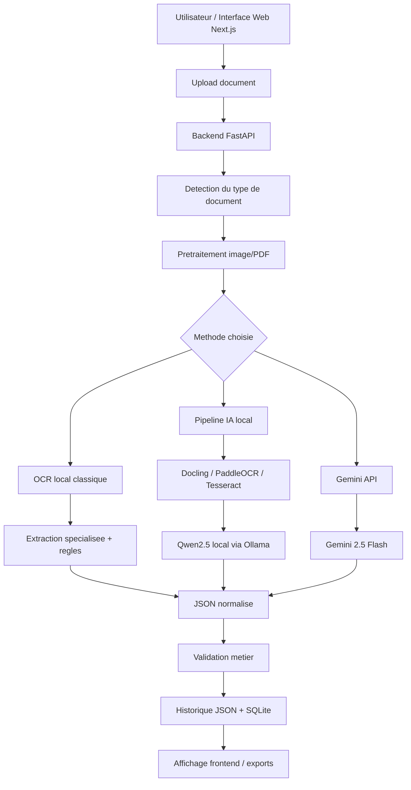

# Rapport architecture, pipelines et choix des modeles DocuAI

Date: 2026-06-08

## 1. Objectif du projet

Le projet DocuAI est une application d'extraction automatique d'informations depuis des documents heterogenes:

- factures STEG;
- factures fournisseurs;
- tickets de caisse;
- analyses medicales;
- images scannees ou PDF.

L'objectif est de transformer un document non structure en un JSON exploitable, avec des champs metier, un score qualite, des warnings et un historique sauvegarde.

## 2. Architecture generale



## 3. Composants principaux

| Composant | Role |
| --- | --- |
| Frontend Next.js | Interface web pour login, upload, resultats, historique, dashboard et parametres. |
| Backend FastAPI | Point central: recoit les documents, lance les pipelines, valide et sauvegarde les resultats. |
| Document router | Detecte le type du document: STEG, medical, receipt, supplier invoice ou unknown. |
| Pretraitement | Corrige orientation, resize, deskew, contraste, nettete et prepare le document pour OCR. |
| Tesseract OCR | OCR local classique pour lire le texte depuis les images. |
| Docling | Convertit surtout les PDF/documents en contenu structure, souvent Markdown. |
| PaddleOCR | OCR local avance utilise comme fallback quand Docling ou Tesseract ne suffit pas. |
| Qwen2.5 via Ollama | Modele local qui lit le texte OCR/Markdown et produit un JSON. |
| Gemini API | Modele externe Google utilise si une cle API est configuree. |
| SQLite + fichiers JSON | Stockage de l'historique des extractions et erreurs. |

## 4. Choix des modeles utilises

### 4.1 OCR local classique

Mode selectionne dans l'interface:

```text
OCR local classique
```

Technologie principale:

```text
Tesseract OCR
```

Role:

- lire le texte directement depuis une image;
- extraire les champs avec des regles specialisees;
- fonctionner sans internet et sans API externe.

Cas ou il est le plus adapte:

- facture STEG;
- analyse medicale.

Limite actuelle:

- les tickets de caisse et factures fournisseurs generiques ne sont pas encore completement supportes en OCR classique pur. Pour ces documents, il faut plutot utiliser le pipeline IA local ou Gemini.

### 4.2 Pipeline IA local

Mode selectionne dans l'interface:

```text
Pipeline IA local (Docling + PaddleOCR + Qwen2.5)
```

Modeles/outils utilises:

```text
Docling
PaddleOCR
Tesseract fallback
Qwen2.5 local via Ollama
```

Modele Ollama configure:

```env
OLLAMA_HOST=http://127.0.0.1:11434
OLLAMA_MODEL=qwen2.5:7b-instruct
```

Role de chaque element:

| Element | Role |
| --- | --- |
| Docling | Convertir le document en texte structure ou Markdown. |
| PaddleOCR | Lire les images/scans si Docling produit un contenu faible. |
| Tesseract fallback | Secours OCR rapide si PaddleOCR est lent ou indisponible. |
| Qwen2.5 | Comprendre le texte et remplir le schema JSON attendu. |
| Ollama | Serveur local qui execute Qwen sur la machine. |

Avantages:

- fonctionne localement;
- pas besoin de Gemini;
- donne un JSON structure pour plusieurs familles de documents.

Limites:

- Qwen local peut etre lent sur une machine CPU;
- un timeout est possible si Ollama ou le modele est surcharge;
- le modele actuellement utilise est le modele standard `qwen2.5:7b-instruct`, pas encore un modele fine-tune.

### 4.3 Gemini API

Mode selectionne dans l'interface:

```text
Gemini API
```

Modele configure dans `.env.example`:

```env
GEMINI_MODEL=gemini-2.5-flash
```

Role:

- envoyer le document ou son contenu a Gemini;
- demander directement un JSON conforme au type de document;
- utile pour les tickets de caisse et factures fournisseurs quand OCR local ou Qwen local est insuffisant.

Condition obligatoire:

```env
GEMINI_API_KEY=ta_cle_api
```

Etat actuel:

- la cle Gemini n'est pas configuree dans `.env`;
- donc l'application signale correctement une erreur "cle Gemini manquante";
- le test live Gemini ne peut etre fait qu'apres ajout d'une vraie cle API.

## 5. Pipeline detaille par methode

### 5.1 Pipeline OCR local classique

```text
Image/PDF
  -> Pretraitement
  -> Tesseract OCR
  -> Texte brut
  -> Regles specialisees
  -> JSON
  -> Validation qualite
  -> Sauvegarde historique
```

Pour STEG, le projet lit des zones precises:

- zone reference;
- zone montant a payer;
- zone date limite paiement;
- zones complementaires si un champ manque.

Exemple de sortie STEG:

```json
{
  "document_type": "steg_invoice",
  "reference": "747268800",
  "montant_a_payer": "645,000",
  "date_limite_paiement": "2024-08-28"
}
```

Pour analyse medicale, le pipeline cherche:

- nom patient;
- identifiant patient;
- numero dossier;
- dates;
- lignes d'analyses;
- valeur, unite, intervalle de reference, statut.

### 5.2 Pipeline local Docling + PaddleOCR + Qwen

```text
Document image/PDF
  -> Pretraitement
  -> Docling si document exploitable
  -> Controle qualite du Markdown
  -> PaddleOCR si contenu faible
  -> Tesseract fallback si PaddleOCR est lent
  -> Prompt avec schema JSON
  -> Qwen2.5 via Ollama
  -> JSON retourne
  -> Validation metier
  -> Sauvegarde historique
```

Le backend envoie a Qwen:

- le type cible du document;
- le texte OCR ou Markdown;
- le schema JSON attendu;
- une consigne pour ne pas inventer de valeurs.

Schemas principaux:

| Type | Champs attendus |
| --- | --- |
| `steg_invoice` | reference, compteur, date facture, montant, date limite, periode. |
| `medical_lab_report` | patient, laboratoire, dossier, dates, tests. |
| `receipt` | magasin, date, ticket, articles, total, paiement. |
| `supplier_invoice` | numero facture, vendeur, client, articles, taxes, total. |

### 5.3 Pipeline Gemini API

```text
Document
  -> Backend FastAPI
  -> Appel Gemini API
  -> Reponse JSON
  -> Normalisation
  -> Validation metier
  -> Sauvegarde historique
```

Gemini est pratique quand:

- l'image est difficile;
- le document est varie;
- les tickets de caisse et factures fournisseurs demandent plus de comprehension visuelle;
- le modele local Qwen est trop lent.

## 6. Choix recommande selon le document

| Document | Methode recommandee | Pourquoi |
| --- | --- | --- |
| Facture STEG | OCR local classique ou local rapide | Les zones reference/montant/date sont bien identifiees. |
| Analyse medicale | OCR local classique | Les lignes d'analyses sont extractibles avec un pipeline specialise. |
| Ticket de caisse | Gemini ou pipeline IA local | Besoin de comprehension plus flexible des articles et totaux. |
| Facture fournisseur | Gemini ou pipeline IA local | Structure variable, vendeur/client/articles/taxes. |
| PDF texte propre | Pipeline IA local avec Docling | Docling garde mieux la structure du document. |
| Image faible qualite | Gemini si disponible, sinon OCR local + verification | Le visuel peut etre difficile pour OCR local. |

## 7. Validation et qualite

Chaque resultat est controle par le backend.

Exemples de controles:

- champ obligatoire absent;
- liste d'articles vide;
- liste d'analyses vide;
- montant non detecte;
- format montant incertain;
- type de document non reconnu;
- timeout OCR ou Qwen;
- cle Gemini manquante.

Le resultat contient souvent:

```json
{
  "qualityScore": 76.0,
  "warnings": [],
  "local_pipeline": {
    "content_source": "paddleocr_text",
    "ollama_model": "qwen2.5:7b-instruct"
  }
}
```

## 8. Donnees de test

Les documents originaux de test sont dans:

```text
Data/raw_Data
```

Details:

```text
Data/raw_Data/electricite
Data/raw_Data/electricite copy
Data/raw_Data/medical
Data/raw_Data/analyse_medical
Data/raw_Data/ticketsCasse
```

Facture fournisseur utilisee dans les tests:

```text
Data/history/extractions/supplier_invoice
```

Datasets fine-tuning:

```text
Data/finetuning
```

Fichiers importants:

```text
Data/finetuning/llamafactory/train.jsonl
Data/finetuning/llamafactory/val.jsonl
Data/finetuning/llamafactory/test.jsonl
Data/finetuning/processed/ground_truth
Data/finetuning/manifests
```

## 9. Donnees generees par l'application

Chaque extraction genere des fichiers dans:

```text
Data/history/extractions
```

Exemples:

```text
Data/history/extractions/steg_ocr
Data/history/extractions/steg_local
Data/history/extractions/medical_ocr
Data/history/extractions/medical_local
Data/history/extractions/receipt_local
Data/history/extractions/supplier_invoice_local
Data/history/extractions/extraction_error
```

Base SQLite:

```text
Data/history/extractions.db
```

Rapports QA:

```text
outputs/qa_validation
```

## 10. Etat actuel du projet

Backend:

```text
http://127.0.0.1:8000/api/health
```

Frontend:

```text
http://127.0.0.1:3000/login
```

Etat verifie:

- frontend et backend fonctionnent;
- OCR STEG fonctionne;
- OCR analyse medicale fonctionne;
- detection automatique fonctionne pour STEG, medical, ticket et fournisseur;
- Gemini signale correctement l'absence de cle API;
- Ollama est installe avec `qwen2.5:7b-instruct`;
- Qwen local peut etre lent et provoquer des timeouts sur certains documents.

## 11. Fine-tuning

Le fine-tuning n'est pas applique actuellement.

Constat:

- les datasets de fine-tuning existent;
- aucun artefact entraine n'a ete trouve dans le projet;
- Ollama utilise actuellement le modele standard `qwen2.5:7b-instruct`.

Modele actuel:

```text
qwen2.5:7b-instruct
```

Modele attendu apres fine-tuning, exemple:

```env
OLLAMA_MODEL=docuai-qwen2.5-lora:latest
```

Le fine-tuning doit etre vu comme une phase separee:

```text
Documents + OCR/Markdown + JSON corrige humainement
  -> dataset train/validation/test
  -> entrainement LoRA
  -> integration dans Ollama
  -> utilisation dans l'application
```

## 12. Conclusion

Le projet possede trois chemins d'extraction:

1. OCR local classique: rapide, local, tres utile pour STEG et medical.
2. Pipeline IA local: Docling + PaddleOCR + Qwen2.5 via Ollama, utile pour documents varies mais plus lent.
3. Gemini API: puissant pour documents complexes, mais necessite une cle API.

Le choix du modele depend donc du document:

- STEG et medical: privilegier OCR local specialise;
- tickets et factures fournisseurs: privilegier Gemini si disponible, sinon pipeline IA local;
- documents PDF propres: privilegier Docling + Qwen local;
- documents difficiles: comparer Gemini et local puis valider les champs.

