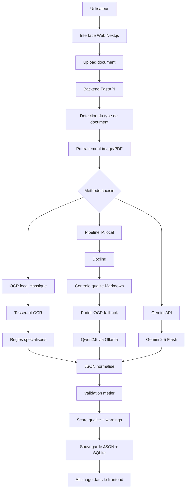

# Rapport complet: choix du modele, architecture des pipelines et calculs d'evaluation

Date: 2026-06-08

## 1. Introduction

Ce projet a pour objectif d'extraire automatiquement les informations importantes depuis plusieurs types de documents:

- factures STEG;
- factures fournisseurs;
- tickets de caisse;
- analyses medicales;
- documents images ou PDF.

Le systeme ne depend pas d'une seule methode. Il compare plusieurs pipelines d'extraction afin de choisir le plus adapte selon le type du document, la qualite attendue, le temps de traitement, le cout et la confidentialite.

Les trois familles principales de pipelines sont:

```text
1. OCR local classique
2. Pipeline IA local: Docling + PaddleOCR + Qwen via Ollama
3. Gemini API
```

## 2. Objectif du choix du modele

Le but n'est pas de choisir le modele le plus connu ou le plus puissant. Le but est de choisir le pipeline qui donne le meilleur resultat pour chaque famille de documents.

Le choix doit etre base sur des mesures:

- accuracy;
- precision;
- recall;
- F1-score;
- taux de JSON valide;
- taux de champs critiques corrects;
- temps de traitement;
- cout;
- confidentialite;
- robustesse.

La demarche adoptee est:

```text
OCR local comme baseline
  -> calcul des metriques
  -> comparaison avec Docling + PaddleOCR + Qwen
  -> comparaison avec Gemini API
  -> choix du meilleur pipeline par type de document
```

## 3. Architecture generale du systeme



## 4. Les pipelines compares

### 4.1 Pipeline 1: OCR local classique

Ce pipeline est utilise comme baseline.

Composants:

```text
Tesseract OCR
Pretraitement image
Regles d'extraction specialisees
Validation JSON
```

Fonctionnement:

```text
Document image/PDF
  -> correction orientation
  -> resize
  -> amelioration contraste
  -> Tesseract OCR
  -> extraction par regles
  -> JSON final
```

Avantages:

- fonctionne sans internet;
- gratuit;
- rapide;
- explicable;
- tres utile pour les documents fixes comme STEG.

Limites:

- moins flexible pour les tickets de caisse;
- moins robuste pour les factures fournisseurs variees;
- depend fortement de la qualite de l'image.

Cas recommandes:

```text
Factures STEG
Analyses medicales
```

### 4.2 Pipeline 2: IA locale Docling + PaddleOCR + Qwen

Ce pipeline est le moteur local intelligent.

Composants:

```text
Docling
PaddleOCR
Tesseract fallback
Qwen2.5 via Ollama
```

Modele local utilise actuellement:

```text
qwen2.5:7b-instruct
```

Configuration:

```env
OLLAMA_HOST=http://127.0.0.1:11434
OLLAMA_MODEL=qwen2.5:7b-instruct
```

Fonctionnement:

```text
Document
  -> pretraitement
  -> Docling convertit vers Markdown/texte structure
  -> controle qualite du texte
  -> PaddleOCR si le texte est faible
  -> Tesseract fallback si PaddleOCR est trop lent
  -> prompt avec schema JSON
  -> Qwen genere le JSON
  -> validation metier
```

Avantages:

- fonctionne localement;
- meilleur pour documents variables;
- peut comprendre le contexte;
- produit directement un JSON structure.

Limites:

- plus lent que OCR local;
- Qwen peut faire timeout sur CPU;
- le modele actuel n'est pas encore fine-tune.

Cas recommandes:

```text
PDF texte propre
Factures fournisseurs
Tickets de caisse si Gemini n'est pas disponible
Documents generiques
```

### 4.3 Pipeline 3: Gemini API

Ce pipeline utilise un modele externe via API.

Modele configure:

```env
GEMINI_MODEL=gemini-2.5-flash
```

Condition obligatoire:

```env
GEMINI_API_KEY=ta_cle_api
```

Fonctionnement:

```text
Document
  -> backend
  -> envoi a Gemini
  -> Gemini comprend le document
  -> retour JSON
  -> normalisation
  -> validation metier
```

Avantages:

- tres fort pour comprendre des documents variables;
- utile pour tickets de caisse et factures fournisseurs;
- meilleur sur images difficiles.

Limites:

- necessite internet;
- necessite une cle API;
- peut avoir un cout;
- les donnees quittent la machine.

Cas recommandes:

```text
Tickets de caisse
Factures fournisseurs complexes
Images difficiles
Comparaison de reference avec le local
```

## 5. Donnees de test

Les donnees originales de test sont ici:

```text
Data/raw_Data
```

Par type:

```text
Data/raw_Data/electricite        factures STEG
Data/raw_Data/electricite copy   copies STEG
Data/raw_Data/medical            analyses medicales
Data/raw_Data/analyse_medical    autres analyses medicales
Data/raw_Data/ticketsCasse       tickets de caisse
```

Factures fournisseurs:

```text
Data/history/extractions/supplier_invoice
```

Données pour fine-tuning:

```text
Data/finetuning
Data/finetuning/processed/ground_truth
Data/finetuning/llamafactory/train.jsonl
Data/finetuning/llamafactory/val.jsonl
Data/finetuning/llamafactory/test.jsonl
```

Les resultats generes sont sauvegardes ici:

```text
Data/history/extractions
Data/history/extractions.db
outputs/qa_validation
```

## 6. Ground truth

Pour calculer les metriques, chaque document de test doit avoir un JSON correct appele ground truth.

Exemple de ground truth pour une facture STEG:

```json
{
  "document_type": "steg_invoice",
  "reference": "747268800",
  "montant_a_payer": "645,000",
  "date_limite_paiement": "2024-08-28"
}
```

Le resultat du modele est compare a ce JSON corrige manuellement.

## 7. Metriques de calcul

### 7.1 Accuracy de detection

Cette metrique verifie si le systeme reconnait le bon type de document.

Formule:

```text
Detection Accuracy = nombre de documents correctement classes / nombre total de documents
```

Exemple:

```text
4 documents bien detectes sur 4
Detection Accuracy = 4 / 4 = 1.00 = 100%
```

### 7.2 Valid JSON Rate

Cette metrique verifie si le pipeline retourne un JSON valide.

Formule:

```text
Valid JSON Rate = nombre de JSON valides / nombre total de sorties
```

Exemple:

```text
18 JSON valides sur 20 sorties
Valid JSON Rate = 18 / 20 = 0.90 = 90%
```

### 7.3 Field Accuracy

Cette metrique verifie si les champs extraits sont corrects.

Formule:

```text
Field Accuracy = nombre de champs corrects / nombre total de champs attendus
```

Exemple STEG:

| Champ | Ground truth | Prediction | Resultat |
| --- | --- | --- | --- |
| reference | 747268800 | 747268800 | correct |
| montant_a_payer | 645,000 | 645,000 | correct |
| date_limite_paiement | 2024-08-28 | 2024-10-03 | incorrect |

Calcul:

```text
2 champs corrects / 3 champs attendus
Field Accuracy = 2 / 3 = 0.667 = 66.7%
```

### 7.4 Precision, Recall et F1-score

Definitions:

```text
TP = champ correctement extrait
FP = champ extrait mais incorrect
FN = champ attendu mais absent ou mauvais
```

Formules:

```text
Precision = TP / (TP + FP)
Recall    = TP / (TP + FN)
F1-score  = 2 * Precision * Recall / (Precision + Recall)
```

Exemple:

```text
TP = 2
FP = 1
FN = 1
```

Calcul:

```text
Precision = 2 / (2 + 1) = 0.667
Recall    = 2 / (2 + 1) = 0.667
F1-score  = 2 * 0.667 * 0.667 / (0.667 + 0.667)
F1-score  = 0.667
```

### 7.5 Critical Field Accuracy

Tous les champs n'ont pas la meme importance. Certains champs sont critiques.

Champs critiques STEG:

```text
reference
montant_a_payer
date_limite_paiement
```

Champs critiques analyse medicale:

```text
patient_name
dossier_number
tests.raw_test_name
tests.value
tests.unit
```

Champs critiques ticket:

```text
store_name
ticket_number
items
total
```

Champs critiques facture fournisseur:

```text
invoice_number
seller.name
seller.tax_id
items
summary.total_amount
```

Formule:

```text
Critical Field Accuracy = champs critiques corrects / champs critiques attendus
```

### 7.6 CER pour OCR

CER signifie Character Error Rate. Il mesure les erreurs au niveau caractere.

Formule:

```text
CER = distance d'edition caracteres / nombre de caracteres dans le texte correct
```

Exemple:

```text
Texte correct : 747268800
OCR predit    : 147268800
Erreur        : 1 caractere
CER           = 1 / 9 = 0.111 = 11.1%
```

### 7.7 WER pour OCR

WER signifie Word Error Rate. Il mesure les erreurs au niveau mot.

Formule:

```text
WER = distance d'edition mots / nombre de mots dans le texte correct
```

CER et WER permettent de savoir si l'erreur vient de l'OCR ou de l'etape d'extraction JSON.

## 8. Score final de choix du modele

Pour choisir le meilleur pipeline, on peut utiliser un score pondere.

Proposition:

```text
Score final =
  0.40 * Field F1
+ 0.20 * Critical Field Accuracy
+ 0.15 * Valid JSON Rate
+ 0.10 * Detection Accuracy
+ 0.10 * Latency Score
+ 0.05 * Cost/Privacy Score
```

Justification des poids:

| Metrique | Poids | Raison |
| --- | ---: | --- |
| Field F1 | 40% | La qualite des champs extraits est la plus importante. |
| Critical Field Accuracy | 20% | Les champs essentiels doivent etre corrects. |
| Valid JSON Rate | 15% | Le resultat doit etre exploitable automatiquement. |
| Detection Accuracy | 10% | Le bon schema depend du bon type de document. |
| Latency Score | 10% | Le systeme doit rester utilisable. |
| Cost/Privacy Score | 5% | Le cout et la confidentialite comptent aussi. |

## 9. Calcul du Latency Score

On fixe un temps de reference, par exemple:

```text
temps_reference = 30 secondes
```

Formule:

```text
Latency Score = min(1, temps_reference / temps_mesure)
```

Exemple:

```text
Pipeline OCR local = 20 secondes
Latency Score = min(1, 30 / 20) = 1.00

Pipeline Qwen local = 90 secondes
Latency Score = min(1, 30 / 90) = 0.33
```

## 10. Cost/Privacy Score

Proposition de notation:

| Pipeline | Score | Justification |
| --- | ---: | --- |
| OCR local | 1.00 | Gratuit, local, confidentiel. |
| Docling + PaddleOCR + Qwen | 0.90 | Local mais plus lourd en ressources. |
| Gemini API | 0.60 | Puissant mais externe, depend d'une API et peut couter. |

## 11. Exemple de calcul complet

Exemple theorique pour les factures STEG.

| Pipeline | Field F1 | Critical Accuracy | Valid JSON | Detection | Latency | Cost/Privacy |
| --- | ---: | ---: | ---: | ---: | ---: | ---: |
| OCR local | 0.92 | 0.95 | 1.00 | 1.00 | 1.00 | 1.00 |
| Docling + Qwen | 0.88 | 0.90 | 0.95 | 1.00 | 0.45 | 0.90 |
| Gemini API | 0.96 | 0.97 | 1.00 | 1.00 | 0.70 | 0.60 |

Calcul OCR local:

```text
Score =
0.40*0.92
+ 0.20*0.95
+ 0.15*1.00
+ 0.10*1.00
+ 0.10*1.00
+ 0.05*1.00

Score =
0.368 + 0.190 + 0.150 + 0.100 + 0.100 + 0.050

Score = 0.958
```

Calcul Gemini:

```text
Score =
0.40*0.96
+ 0.20*0.97
+ 0.15*1.00
+ 0.10*1.00
+ 0.10*0.70
+ 0.05*0.60

Score =
0.384 + 0.194 + 0.150 + 0.100 + 0.070 + 0.030

Score = 0.928
```

Interpretation:

```text
Gemini est legerement meilleur en precision pure,
mais OCR local obtient un meilleur score global pour STEG
car il est plus rapide, local, gratuit et confidentiel.
```

## 12. Tableau experimental a remplir

Pour le rapport final, chaque document teste peut etre note comme ceci.

| Document | Type | Pipeline | JSON valide | Champs attendus | Champs corrects | TP | FP | FN | Precision | Recall | F1 | Temps |
| --- | --- | --- | ---: | ---: | ---: | ---: | ---: | ---: | ---: | ---: | ---: | ---: |
| STEG4.jpg | STEG | OCR local | 1 | 3 | 3 | 3 | 0 | 0 | 1.00 | 1.00 | 1.00 | 25s |
| analyse4.jpg | Medical | OCR local | 1 | 8 | 7 | 7 | 1 | 1 | 0.875 | 0.875 | 0.875 | 40s |
| ticket_zara.jpg | Receipt | Qwen local | 0 | 4 | 0 | 0 | 0 | 4 | 0.00 | 0.00 | 0.00 | timeout |

Puis on regroupe par pipeline.

| Pipeline | Documents testes | Detection Accuracy | Valid JSON Rate | Field F1 moyen | Critical Accuracy | Temps moyen | Score final |
| --- | ---: | ---: | ---: | ---: | ---: | ---: | ---: |
| OCR local | a remplir | a remplir | a remplir | a remplir | a remplir | a remplir | a remplir |
| Docling + PaddleOCR + Qwen | a remplir | a remplir | a remplir | a remplir | a remplir | a remplir | a remplir |
| Gemini API | a remplir | a remplir | a remplir | a remplir | a remplir | a remplir | a remplir |

## 13. Choix recommande par type de document

| Type de document | Pipeline recommande | Justification |
| --- | --- | --- |
| Facture STEG | OCR local specialise | Champs fixes, bonne precision, rapide, gratuit, local. |
| Analyse medicale | OCR local specialise | Extraction structuree des lignes medicales, pas besoin d'API. |
| Ticket de caisse | Gemini API si disponible, sinon Qwen local | Structure variable, articles difficiles, besoin de comprehension. |
| Facture fournisseur | Gemini API si disponible, sinon Qwen local | Mise en page variable, taxes, vendeur/client, articles. |
| PDF propre | Docling + Qwen local | Docling conserve bien la structure. |
| Document tres degrade | Comparaison Gemini / OCR local | Depend de la qualite visuelle. |

## 14. Etat actuel dans le projet

Etat verifie:

```text
Backend FastAPI: OK
Frontend Next.js: OK
OCR STEG: OK sur cas teste
OCR medical: OK sur cas teste
Detection automatique: OK sur cas testes
Ollama: installe
Modele Qwen local: qwen2.5:7b-instruct
Gemini: cle API absente actuellement
Fine-tuning: dataset present mais modele fine-tune non applique
```

Limites actuelles:

```text
Gemini ne peut pas etre teste en live sans GEMINI_API_KEY.
Qwen local peut etre lent et faire timeout sur certains documents.
Le fine-tuning n'est pas encore integre dans Ollama.
```

## 15. Conclusion finale

Le choix du modele dans ce projet est base sur une evaluation comparative.

La methode OCR local est utilisee d'abord comme baseline. Elle est simple, locale, rapide et donne de bons resultats sur les documents structures comme les factures STEG et les analyses medicales.

Le pipeline Docling + PaddleOCR + Qwen est choisi pour apporter une comprehension plus intelligente des documents variables, tout en restant local. Il est utile pour les factures fournisseurs, les tickets de caisse et les PDF structures, mais il peut etre plus lent.

Gemini API est le pipeline le plus puissant pour les documents complexes ou tres variables, mais il depend d'une cle API, d'internet, et peut poser des questions de cout et de confidentialite.

La decision finale n'est donc pas un seul modele pour tout le projet, mais un choix par type de document:

```text
STEG              -> OCR local specialise
Analyse medicale -> OCR local specialise
Ticket caisse     -> Gemini ou Qwen local
Facture fournisseur -> Gemini ou Qwen local
PDF propre        -> Docling + Qwen local
```

Le meilleur pipeline est celui qui maximise le score global:

```text
Score final =
0.40 * Field F1
+ 0.20 * Critical Field Accuracy
+ 0.15 * Valid JSON Rate
+ 0.10 * Detection Accuracy
+ 0.10 * Latency Score
+ 0.05 * Cost/Privacy Score
```

